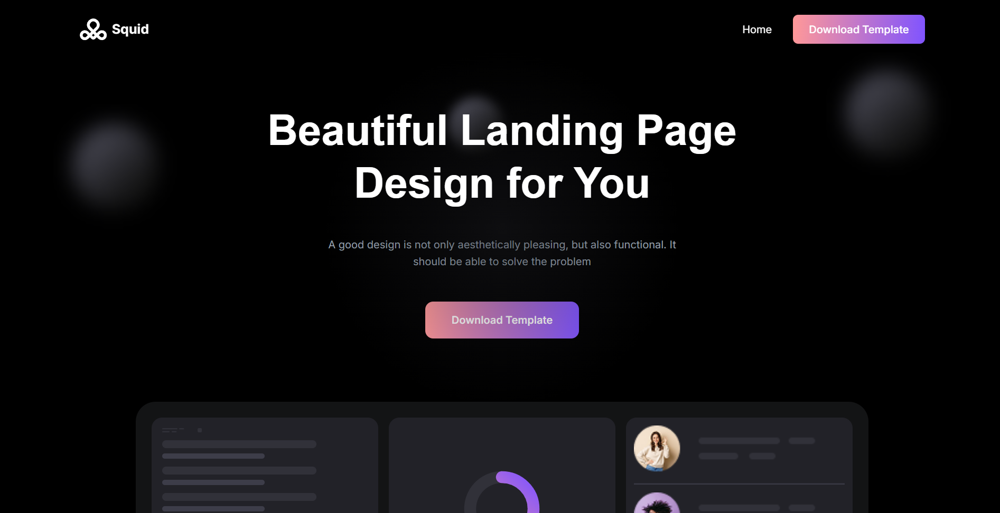
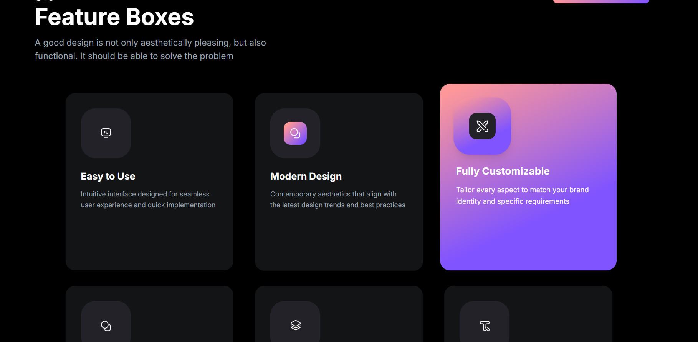
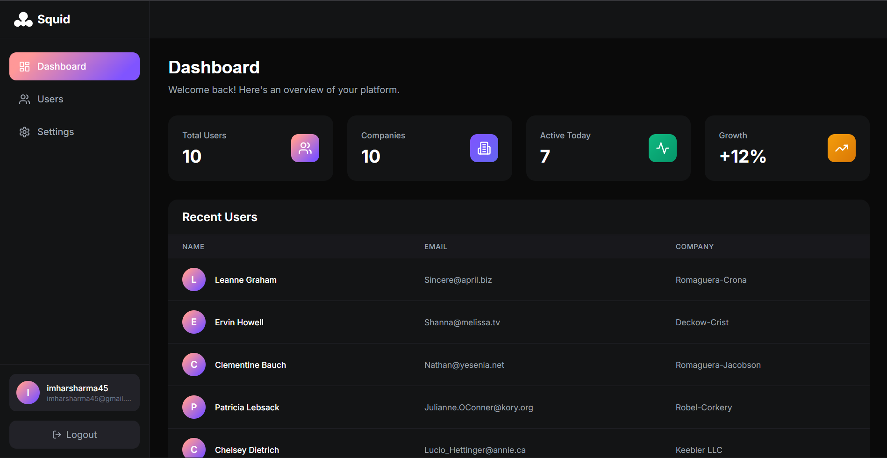
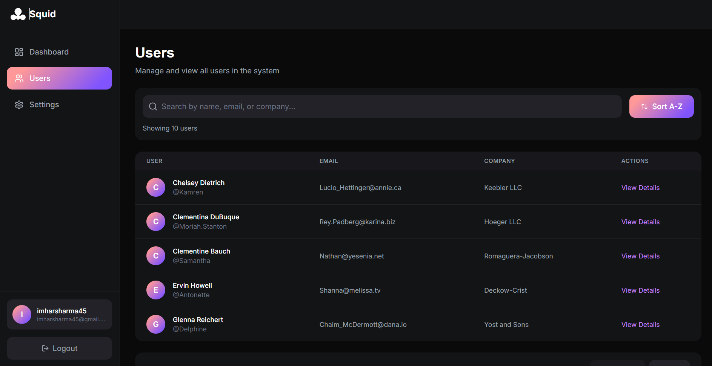
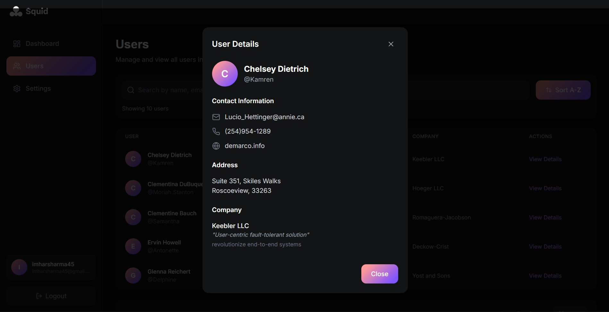

# SaaS Landing Page & Dashboard

A modern, responsive SaaS application built with Next.js 14, featuring a beautiful landing page, authentication system, and comprehensive dashboard interface.

## Setup

### Prerequisites
- Node.js 18.x or higher
- npm or yarn package manager

### Installation

1. Clone the repository
```bash
git clone https://github.com/whysooharsh/saas-task.git
cd saas-task
```

2. Install dependencies
```bash
npm install
```

3. Run the development server
```bash
npm run dev
```

4. Open your browser and navigate to `http://localhost:3000`

### Build for Production
```bash
npm run build
npm start
```

## Features Checklist

### Landing Page
- [x] Responsive hero section with gradient animations
- [x] Interactive feature showcase with hover effects
- [x] Animated dashboard preview mockup
- [x] Companies/partners section
- [x] Call-to-action card with gradient background
- [x] Contact form integration
- [x] Footer with social media links
- [x] Smooth scroll animations using Framer Motion

### Authentication
- [x] User registration (Sign Up)
- [x] User login with validation
- [x] Local storage-based authentication
- [x] Password validation (minimum 6 characters)
- [x] Protected routes for dashboard access
- [x] Persistent login sessions
- [x] Social login UI (Google, Twitter)

### Dashboard
- [x] Main dashboard with statistics cards
- [x] Real-time user data from JSONPlaceholder API
- [x] Responsive grid layout for stats
- [x] Loading states and error handling
- [x] Recent users table with pagination

### Users Management
- [x] Complete user list with search functionality
- [x] Advanced filtering by name, email, or company
- [x] Sortable user table (A-Z, Z-A)
- [x] Pagination with navigation controls
- [x] User detail modal with full information
- [x] Responsive table (columns hide on mobile)

### Settings
- [x] Profile information management
- [x] Dark/Light theme toggle
- [x] Email notification preferences
- [x] Editable user bio
- [x] Form validation and save functionality
- [x] Danger zone (account deletion)

### Design & UX
- [x] Fully responsive (mobile, tablet, desktop)
- [x] Custom gradient color scheme
- [x] Smooth animations and transitions
- [x] Loading spinners and feedback
- [x] Error messages and validation
- [x] Touch-friendly mobile interface
- [x] Consistent typography and spacing

## Screenshots

1. Landing Page Hero

2. Feature Showcase

3. Dashboard Overview

4. Users Management

5. User Detail Modal

6. Settings Page

## Technical Decisions & Tradeoffs

### Technology Stack
**Next.js 14 with App Router**
- Chosen for modern React features, server components, and built-in routing
- Tradeoff: Steeper learning curve compared to Pages Router, but better performance and developer experience

**TypeScript**
- Provides type safety and better IDE support
- Tradeoff: Additional setup time, but prevents runtime errors and improves maintainability

**Tailwind CSS**
- Rapid UI development with utility-first approach
- Inline responsive classes for better component isolation
- Tradeoff: Verbose class names in JSX, but excellent responsive design capabilities

**Framer Motion**
- Smooth, declarative animations for enhanced user experience
- Tradeoff: Adds bundle size (~60KB), but significantly improves visual appeal

### Authentication Strategy
**Local Storage Authentication**
- Simple implementation without backend dependency
- Suitable for demonstration and prototype
- Tradeoff: Not production-ready (should use JWT tokens with httpOnly cookies and backend validation in real applications)

### Data Fetching
**JSONPlaceholder API**
- Free, reliable mock API for user data
- No authentication required for development
- Tradeoff: Limited to GET requests, no real CRUD operations, but perfect for UI demonstration

### State Management
**React Context API + Local State**
- Auth context for user session management
- Component-level state for UI interactions
- Tradeoff: No global state library (Redux/Zustand), but reduces complexity for this scale

### Styling Approach
**Combination of Tailwind + Inline Styles**
- Tailwind for responsive classes and utilities
- Inline styles for specific design requirements (gradients, fixed dimensions)
- Tradeoff: Some inline styles override Tailwind (addressed in latest updates), but allows for precise design control

### Component Architecture
**Client Components Throughout**
- All components use 'use client' for interactivity
- Tradeoff: No server-side rendering benefits, but necessary for animations and client-side state

### Form Handling
**Controlled Components with Local State**
- Simple form management without libraries (Formik/React Hook Form)
- Tradeoff: Manual validation logic, but lightweight and straightforward

### Responsive Design
**Mobile-First Approach**
- Base styles for mobile, enhanced for larger screens
- Strategic content hiding on smaller devices
- Tradeoff: Some features simplified on mobile, but ensures usability across all devices

### Performance Considerations
**No Image Optimization**
- Using Cloudinary CDN for images
- Tradeoff: Could use Next.js Image component for better optimization, but Cloudinary provides reliable hosting

**Client-Side Rendering**
- All pages rendered on client
- Tradeoff: Slower initial load compared to SSR, but simpler implementation for this scope

### Browser Compatibility
**Modern Browsers Only**
- Targeting Chrome, Firefox, Safari, Edge (latest versions)
- Using modern CSS features (backdrop-filter, grid, flexbox)
- Tradeoff: No IE11 support, but cleaner code and better features


